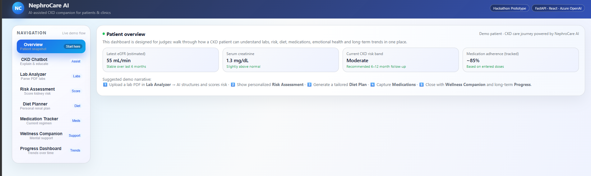
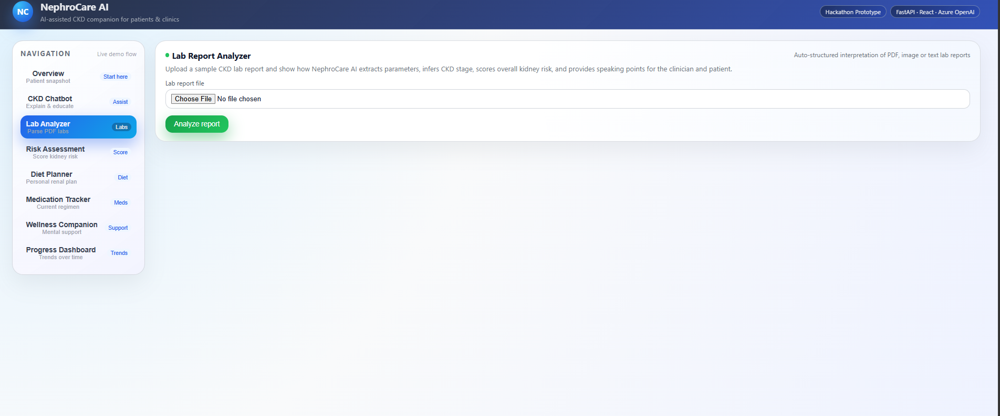
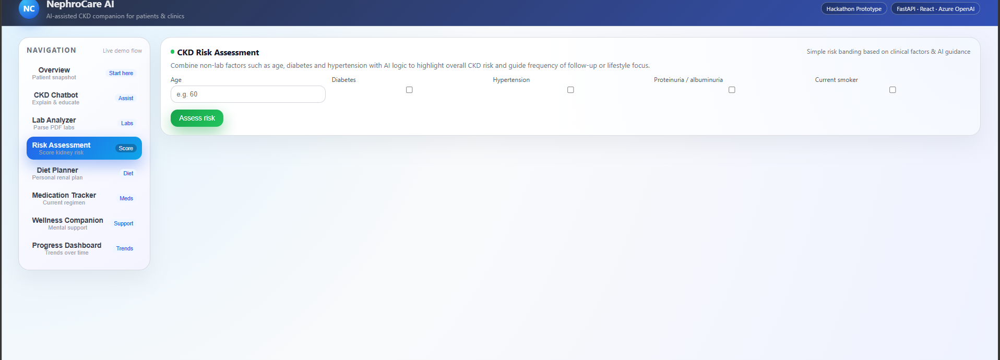
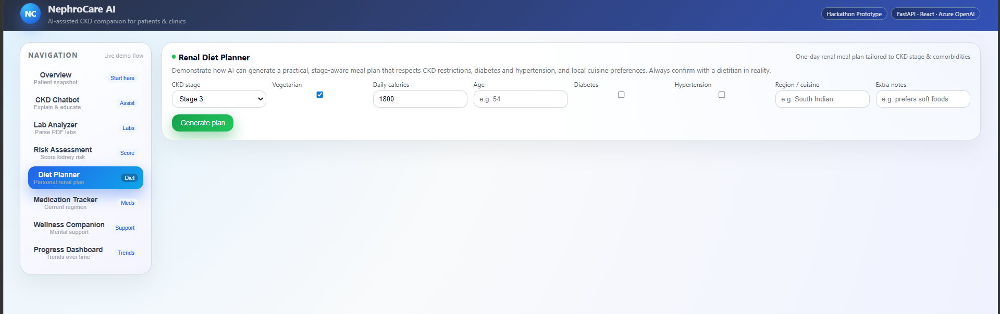
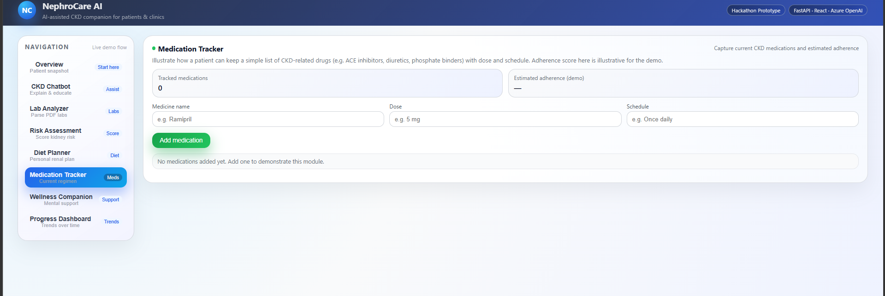
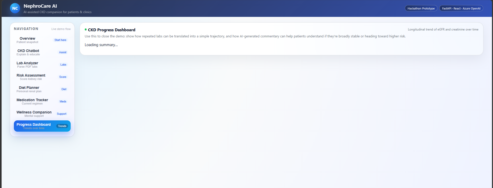

# NephroCare AI Platform

AI-powered kidney health assistant built with **React**, **FastAPI**, and intelligent healthcare workflows for patients and clinics. Designed as a full-stack prototype focused on Chronic Kidney Disease (CKD) support, risk awareness, nutrition planning, medication tracking, and patient education.

---

## Dashboard Preview



---

## Project Overview

NephroCare AI is a digital health prototype that helps simplify kidney care journeys through one integrated platform.

The system combines:

- Clinical risk awareness tools  
- Patient-friendly AI assistance  
- Lab report understanding  
- Personalized renal diet planning  
- Medication tracking  
- Emotional wellness support  
- Long-term progress visualization  

---

## Key Features

### 1. Patient Overview Dashboard

Central dashboard showing:

- Estimated eGFR
- Creatinine summary
- CKD risk band
- Medication adherence snapshot
- Guided patient journey flow

---

### 2. CKD Support Chatbot

Interactive assistant for common kidney health questions.

Examples:

- What does creatinine mean?
- What is eGFR?
- What foods should I avoid?
- How often should I follow up?

---

### 3. Lab Report Analyzer

Upload lab reports and structure important values such as:

- Creatinine
- eGFR
- Urea
- Potassium
- HbA1c

Provides simplified patient-friendly interpretation.



---

### 4. CKD Risk Assessment

Uses patient health indicators such as:

- Age
- Diabetes
- Hypertension
- Smoking history
- Proteinuria indicators

Outputs risk banding for awareness and follow-up planning.



---

### 5. Renal Diet Planner

Generate stage-aware meal guidance based on:

- CKD stage
- Vegetarian preference
- Daily calories
- Age
- Diabetes
- Hypertension
- Regional cuisine preference



---

### 6. Medication Tracker

Track kidney-related medications and adherence estimates.

Examples:

- ACE inhibitors
- Diuretics
- Phosphate binders



---

### 7. Wellness Companion

Emotional support module for patients dealing with stress, anxiety, or fear related to kidney disease.

Encourages:

- Self-care habits
- Calm explanations
- Professional follow-up when needed

---

### 8. Progress Dashboard

Visual trend monitoring for repeated kidney metrics over time.

Tracks:

- eGFR trends
- Creatinine progression
- Stability summaries



---

## Tech Stack

### Frontend

- React.js
- JavaScript
- CSS

### Backend

- FastAPI
- Python
- REST APIs
- Pydantic

### AI / Logic Layer

- Prompt workflows
- Rule-based scoring
- Clinical guidance modules

---

## Project Structure

```text
nephrocare-ai-platform/
│── backend/
│── frontend/
│── README.md
│── dashboard-main.png
│── lab-analyzer.png
│── risk-assessment.png
│── diet-planner.png
│── medication-tracker.png
│── progress-dashboard.png
